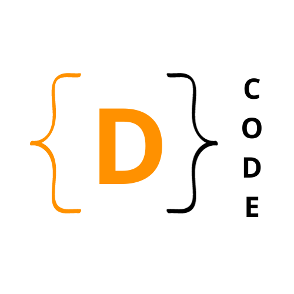

  

# Welcome to DCODE Official Repository! 🚀

Explore the coding wonders with DCODE, the coding club at Jorhat Engineering College, Assam, India.

## About DCODE

DCODE was founded in 2022 by Forheen Ahmed along with Professor Mr. Biswajit Sarma, who serves as the Club's In-Charge from the Computer Science & Engineering Department.

### 🎯 Mission and Goals

The club is dedicated to promoting a vibrant coding culture and focuses on the following areas:

- Competitive Programming
- Data Structures and Algorithms
- Off-Campus Placement Preparation
- Development in areas such as Machine Learning, Frontend, Backend, DevOps, and App Development.

### 🏆 Achievements

Successfully conducted 2 workshops on Data Structures and Algorithms (DSA) to date.

## Club Leadership

Meet the visionary leaders guiding DCODE:

- **Founder:** Forheen Ahmed - [GitHub](https://github.com/Forheen), [LinkedIn](https://www.linkedin.com/in/forheen-ahmed-a994b9201/)
- **In-Charge:** Professor Mr. Biswajit Sarma - [Contact Information](https://jecassam.ac.in/wp-content/uploads/2022/11/bs.pdf)
- **Firoz Anjum Chowdhury** - [GitHub](https://github.com/Firoz1402), [LinkedIn](https://www.linkedin.com/in/firoz-anjum-chowdhury-2a8574299/)
- **Gouranga Borah** - [GitHub](https://github.com/b-Gouranga), [LinkedIn](https://www.linkedin.com/in/gouranga-borah-87b080249/)
- **Keshab Sen** - [GitHub](https://github.com/Keshab002), [LinkedIn](https://www.linkedin.com/in/keshab-sen-a82b90251/)

Feel free to connect with us and explore our individual contributions.

## Getting Started 🚀

1. Explore the various branches for different development and languages.
2. This is the `Main` branch, which contains the introduction.
3. Check out the documentation and code samples available.
4. Join our discussions and stay updated with club announcements.

## 🌟 Contributing

We welcome contributions from members and the community. If you have ideas, bug fixes, or want to contribute in any way, feel free to open an issue or submit a pull request.

## Usage 🌍

This repository is open to anyone across the world for learning purposes. Feel free to explore the code and resources available here.

## Contact 📬

For any inquiries, you can contact our core members directly. We are open to collaborations and discussions from individuals around the world.

Happy coding! 🚀

